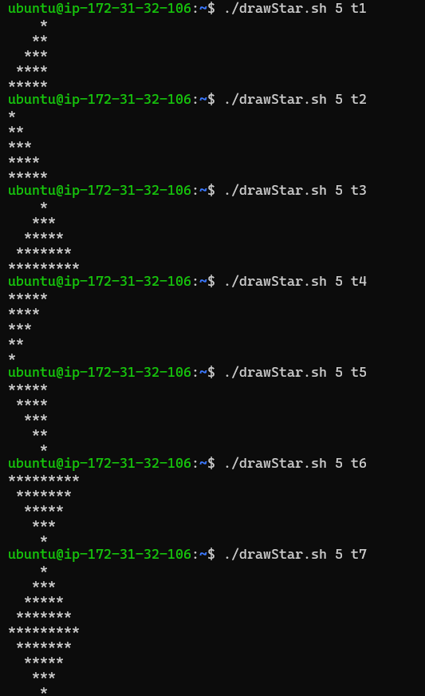
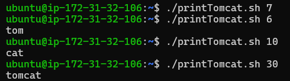

Assignment 3 Submitted by Devashish Sathawane

PART A
First we have to make drawStar.sh script
Then give the chmod +x drawStar.sh give execute permission

PART B
Make printTomcat.sh script
Then again give the execute permission chmod +x printTomcat.sh

